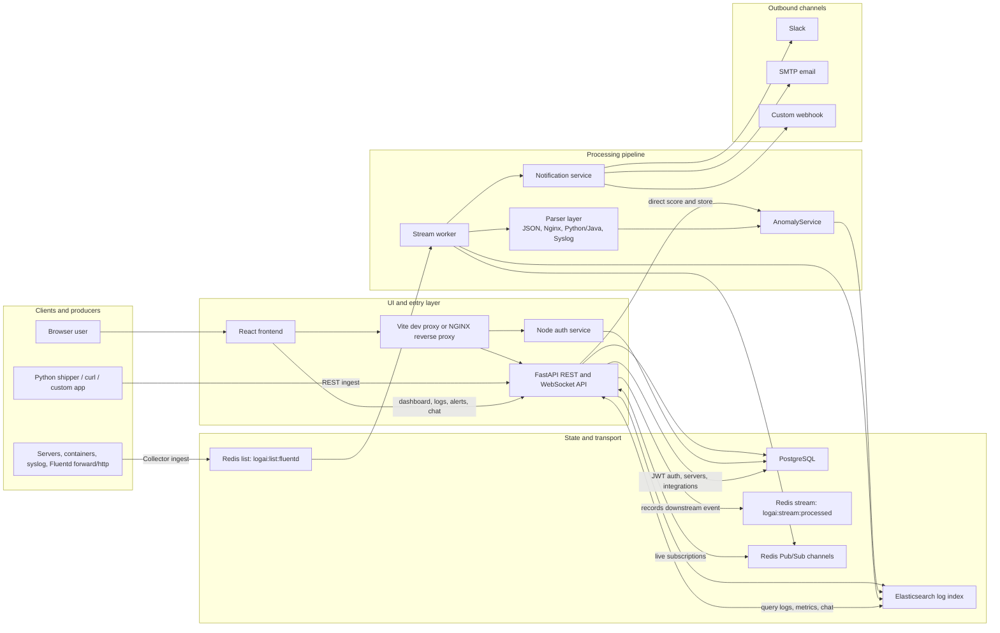

# LogAI Architecture Flow

This document describes the current project architecture across the active frontend, backend, worker, and infrastructure services.

For a reusable Mermaid-only source file, see [ARCHITECTURE_FLOW.mmd](ARCHITECTURE_FLOW.mmd).

## Rendered Diagram

## Flow Walkthrough

### 1. User access and authentication

- The browser loads the React dashboard.
- During local development, Vite proxies API and WebSocket traffic.
- In the Docker-backed stack, NGINX acts as the unified edge entry point.
- Email/password auth is handled by FastAPI under `/api/v1/auth/*`.
- Google and GitHub OAuth are handled by the Node auth service under `/api/auth/*`.
- FastAPI and the auth service both rely on the same PostgreSQL user records and shared JWT secret.

### 2. Direct API ingestion

- Clients such as the Python shipper, cURL, or custom apps send logs to `/api/v1/ingest` or `/api/v1/ingest/batch`.
- FastAPI validates the incoming API key against the user's server records.
- The `AnomalyService` scores each log.
- The log is written to Elasticsearch immediately.
- The current implementation also writes an event to the Redis stream `logai:stream:processed`.

### 3. Collector-based ingestion

- Fluentd accepts forward, HTTP, and syslog traffic.
- Fluentd enriches incoming records with server and environment context.
- Enriched records are pushed to the Redis list `logai:list:fluentd`.
- The stream worker consumes queued items from Redis and runs them through the shared processing pipeline.

### 4. Worker pipeline

- The worker parses structured and unstructured logs.
- Supported parsing paths include JSON, Nginx-style access logs, Python/Java logging formats, and syslog-style lines.
- The same `AnomalyService` applies a heuristic fallback and an Isolation Forest path once enough samples exist.
- Processed logs are indexed into Elasticsearch.
- Live log and anomaly events are published to Redis Pub/Sub.
- High-scoring anomalies can trigger Slack, email, and webhook notifications.

### 5. Query, analytics, and live updates

- The dashboard, logs, alerts, analytics, servers, and chat pages call FastAPI.
- FastAPI reads logs and aggregations from Elasticsearch.
- The WebSocket route `/ws` subscribes to Redis Pub/Sub and forwards live events to the browser.
- Integrations and server metadata are stored in PostgreSQL.

## Component Responsibilities

| Component | Primary responsibility | Key location |
| --- | --- | --- |
| React frontend | User dashboard, auth flows, log views, analytics, alerts, integrations, chat | `../LogAI-Frontend-Navroz-Frontend/src` |
| FastAPI backend | REST API, JWT auth, logs, metrics, chat, integrations, WebSocket endpoint | `../LogAI-Backend-main/backend/app` |
| Stream worker | Queue consumption, parsing, anomaly scoring, indexing, live event publishing | `../LogAI-Backend-main/backend/app/workers/stream_worker.py` |
| Node auth service | Google/GitHub OAuth callback flow and JWT issuance | `../LogAI-Backend-main/auth-service/index.js` |
| Fluentd | External collector for forward, HTTP, and syslog sources | `../LogAI-Backend-main/fluentd/conf/fluent.conf` |
| Redis | Queueing, Pub/Sub fan-out, and rate limiting | `../LogAI-Backend-main/backend/app/db/redis_client.py` |
| Elasticsearch | Persistent log search and aggregation engine | `../LogAI-Backend-main/backend/app/services/log_service.py` |
| PostgreSQL | Users, servers, and alert integration settings | `../LogAI-Backend-main/backend/app/models` |

## Implementation Notes

- The current codebase has two ingestion paths that should be documented separately:
  - direct REST ingestion handled inside FastAPI
  - collector-based ingestion handled by Fluentd plus the worker
- Real-time browser updates are powered by Redis Pub/Sub and the FastAPI WebSocket route.
- The anomaly layer is intentionally resilient:
  - heuristic scoring is always available
  - Isolation Forest becomes active after warm-up and retrains on a rolling feature buffer
- Notification delivery depends on saved integration settings plus backend SMTP or webhook availability.

## Raw Mermaid Code

